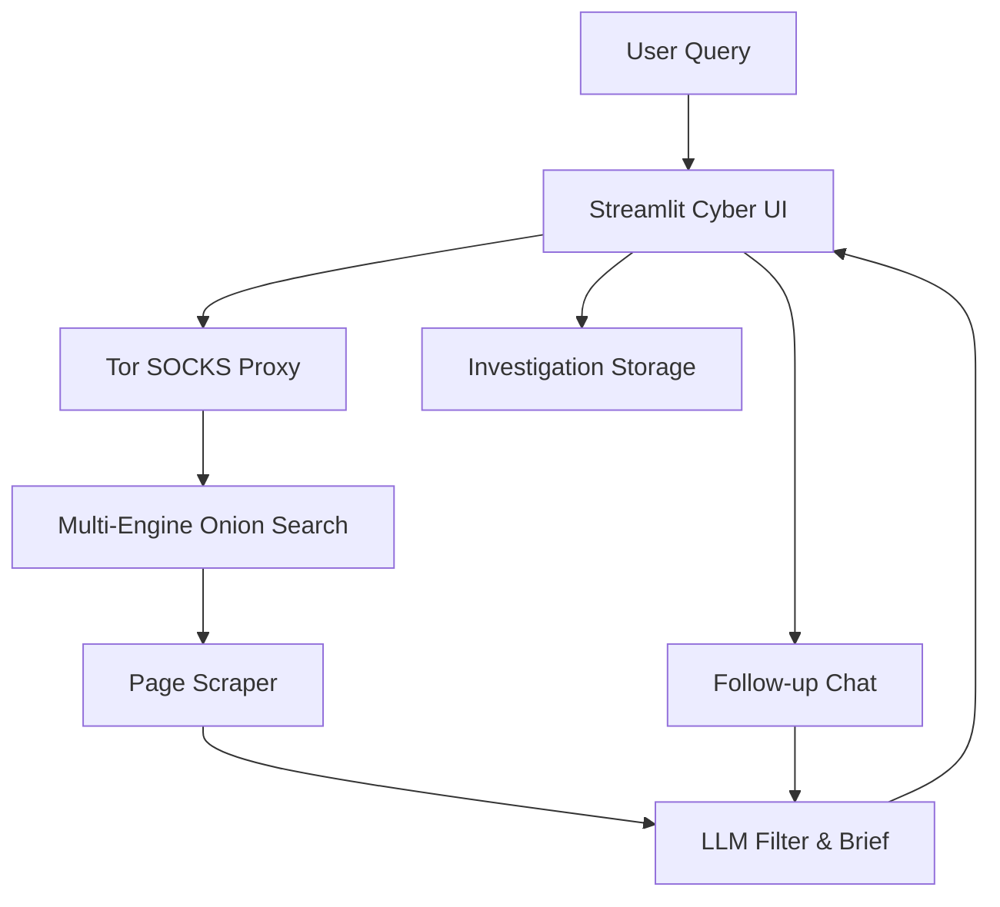
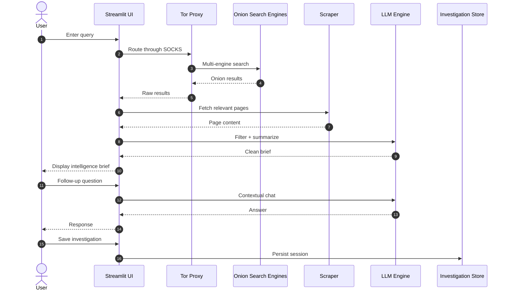

𝐃𝟒𝐊𝟑 𝟐𝟒𝐁

<p align="center">
  
  
  
  
</p>

<p align="center"><b>𝐀𝐈-𝐏𝐨𝐰𝐞𝐫𝐞𝐝 𝐃𝐚𝐫𝐤-𝐖𝐞𝐛 𝐎𝐒𝐈𝐍𝐓 𝐄𝐧𝐠𝐢𝐧𝐞</b></p>

<p align="center"><b>𝐐𝐮𝐞𝐫𝐲 → 𝐌𝐮𝐥𝐭𝐢-𝐄𝐧𝐠𝐢𝐧𝐞 𝐎𝐧𝐢𝐨𝐧 𝐒𝐞𝐚𝐫𝐜𝐡 → 𝐒𝐜𝐫𝐚𝐩𝐞 → 𝐋𝐋𝐌 𝐅𝐢𝐥𝐭𝐞𝐫 & 𝐁𝐫𝐢𝐞𝐟 → 𝐅𝐨𝐥𝐥𝐨𝐰-𝐮𝐩 𝐂𝐡𝐚𝐭</b></p>

<p align="center">
  𝐁𝐮𝐢𝐥𝐭 𝐟𝐨𝐫 <b>𝐃𝐞𝐬𝐤𝐭𝐨𝐩</b> 𝐚𝐧𝐝 <b>𝐀𝐧𝐝𝐫𝐨𝐢𝐝 (𝐓𝐞𝐫𝐦𝐮𝐱 + 𝐎𝐫𝐛𝐨𝐭)</b><br>
  𝐂𝐨𝐦𝐩𝐥𝐞𝐭𝐞𝐥𝐲 𝐢𝐧𝐝𝐞𝐩𝐞𝐧𝐝𝐞𝐧𝐭 𝐜𝐲𝐛𝐞𝐫-𝐭𝐞𝐫𝐦𝐢𝐧𝐚𝐥 𝐔𝐈 𝐝𝐞𝐬𝐢𝐠𝐧𝐞𝐝 𝐟𝐨𝐫 𝐦𝐨𝐛𝐢𝐥𝐞 𝐚𝐧𝐝 𝐝𝐞𝐬𝐤𝐭𝐨𝐩.
</p>

---

## **📖 𝐎𝐯𝐞𝐫𝐯𝐢𝐞𝐰**

**𝐃𝟒𝐊𝟑 𝟐𝟒𝐁** 𝐢𝐬 𝐚 𝐬𝐞𝐥𝐟-𝐜𝐨𝐧𝐭𝐚𝐢𝐧𝐞𝐝 𝐀𝐈-𝐩𝐨𝐰𝐞𝐫𝐞𝐝 𝐎𝐒𝐈𝐍𝐓 𝐞𝐧𝐠𝐢𝐧𝐞 𝐟𝐨𝐜𝐮𝐬𝐞𝐝 𝐨𝐧 𝐭𝐡𝐞 𝐝𝐚𝐫𝐤 𝐰𝐞𝐛.

𝐈𝐭 𝐭𝐚𝐤𝐞𝐬 𝐚 𝐧𝐚𝐭𝐮𝐫𝐚𝐥 𝐥𝐚𝐧𝐠𝐮𝐚𝐠𝐞 𝐪𝐮𝐞𝐫𝐲, 𝐬𝐞𝐚𝐫𝐜𝐡𝐞𝐬 𝐦𝐮𝐥𝐭𝐢𝐩𝐥𝐞 𝐓𝐨𝐫 𝐨𝐧𝐢𝐨𝐧 𝐬𝐞𝐚𝐫𝐜𝐡 𝐞𝐧𝐠𝐢𝐧𝐞𝐬, 𝐬𝐜𝐫𝐚𝐩𝐞𝐬 𝐫𝐞𝐥𝐞𝐯𝐚𝐧𝐭 𝐩𝐚𝐠𝐞𝐬, 𝐟𝐢𝐥𝐭𝐞𝐫𝐬 𝐚𝐧𝐝 𝐬𝐮𝐦𝐦𝐚𝐫𝐢𝐳𝐞𝐬 𝐭𝐡𝐞 𝐫𝐞𝐬𝐮𝐥𝐭𝐬 𝐮𝐬𝐢𝐧𝐠 𝐚𝐧 𝐋𝐋𝐌, 𝐚𝐧𝐝 𝐭𝐡𝐞𝐧 𝐥𝐞𝐭𝐬 𝐲𝐨𝐮 𝐜𝐨𝐧𝐭𝐢𝐧𝐮𝐞 𝐭𝐡𝐞 𝐢𝐧𝐯𝐞𝐬𝐭𝐢𝐠𝐚𝐭𝐢𝐨𝐧 𝐭𝐡𝐫𝐨𝐮𝐠𝐡 𝐟𝐨𝐥𝐥𝐨𝐰-𝐮𝐩 𝐜𝐡𝐚𝐭.

𝐓𝐡𝐞 𝐢𝐧𝐭𝐞𝐫𝐟𝐚𝐜𝐞 𝐢𝐬 𝐝𝐞𝐬𝐢𝐠𝐧𝐞𝐝 𝐚𝐬 𝐚 𝐝𝐚𝐫𝐤 𝐜𝐲𝐛𝐞𝐫-𝐭𝐞𝐫𝐦𝐢𝐧𝐚𝐥 𝐰𝐢𝐭𝐡 𝐚 𝐧𝐞𝐨𝐧 𝐚𝐞𝐬𝐭𝐡𝐞𝐭𝐢𝐜 𝐭𝐡𝐚𝐭 𝐰𝐨𝐫𝐤𝐬 𝐰𝐞𝐥𝐥 𝐨𝐧 𝐛𝐨𝐭𝐡 𝐝𝐞𝐬𝐤𝐭𝐨𝐩 𝐛𝐫𝐨𝐰𝐬𝐞𝐫𝐬 𝐚𝐧𝐝 𝐀𝐧𝐝𝐫𝐨𝐢𝐝 𝐝𝐞𝐯𝐢𝐜𝐞𝐬 𝐫𝐮𝐧𝐧𝐢𝐧𝐠 𝐓𝐞𝐫𝐦𝐮𝐱 + 𝐎𝐫𝐛𝐨𝐭.

---

## **✨ 𝐂𝐨𝐫𝐞 𝐅𝐞𝐚𝐭𝐮𝐫𝐞𝐬**

| 𝐅𝐞𝐚𝐭𝐮𝐫𝐞 | 𝐃𝐞𝐬𝐜𝐫𝐢𝐩𝐭𝐢𝐨𝐧 |
|---------|-------------|
| 🕵️ **𝐌𝐮𝐥𝐭𝐢-𝐄𝐧𝐠𝐢𝐧𝐞 𝐎𝐧𝐢𝐨𝐧 𝐒𝐞𝐚𝐫𝐜𝐡** | 𝐐𝐮𝐞𝐫𝐢𝐞𝐬 𝐦𝐮𝐥𝐭𝐢𝐩𝐥𝐞 𝐓𝐨𝐫-𝐛𝐚𝐬𝐞𝐝 𝐬𝐞𝐚𝐫𝐜𝐡 𝐞𝐧𝐠𝐢𝐧𝐞𝐬 𝐬𝐢𝐦𝐮𝐥𝐭𝐚𝐧𝐞𝐨𝐮𝐬𝐥𝐲 |
| 🧠 **𝐋𝐋𝐌 𝐅𝐢𝐥𝐭𝐞𝐫𝐢𝐧𝐠 & 𝐁𝐫𝐢𝐞𝐟𝐢𝐧𝐠** | 𝐔𝐬𝐞𝐬 𝐀𝐈 𝐭𝐨 𝐟𝐢𝐥𝐭𝐞𝐫 𝐧𝐨𝐢𝐬𝐞 𝐚𝐧𝐝 𝐠𝐞𝐧𝐞𝐫𝐚𝐭𝐞 𝐜𝐥𝐞𝐚𝐧 𝐢𝐧𝐭𝐞𝐥𝐥𝐢𝐠𝐞𝐧𝐜𝐞 𝐛𝐫𝐢𝐞𝐟𝐬 |
| 💬 **𝐅𝐨𝐥𝐥𝐨𝐰-𝐮𝐩 𝐂𝐡𝐚𝐭** | 𝐂𝐨𝐧𝐭𝐢𝐧𝐮𝐞 𝐭𝐡𝐞 𝐢𝐧𝐯𝐞𝐬𝐭𝐢𝐠𝐚𝐭𝐢𝐨𝐧 𝐰𝐢𝐭𝐡 𝐜𝐨𝐧𝐭𝐞𝐱𝐭𝐮𝐚𝐥 𝐜𝐡𝐚𝐭 |
| 🔄 **𝐈𝐧𝐯𝐞𝐬𝐭𝐢𝐠𝐚𝐭𝐢𝐨𝐧 𝐒𝐚𝐯𝐞 / 𝐋𝐨𝐚𝐝** | 𝐒𝐚𝐯𝐞 𝐚𝐧𝐝 𝐫𝐞𝐬𝐮𝐦𝐞 𝐢𝐧𝐯𝐞𝐬𝐭𝐢𝐠𝐚𝐭𝐢𝐨𝐧𝐬 |
| 📱 **𝐀𝐧𝐝𝐫𝐨𝐢𝐝 𝐑𝐞𝐚𝐝𝐲** | 𝐅𝐮𝐥𝐥𝐲 𝐨𝐩𝐭𝐢𝐦𝐢𝐳𝐞𝐝 𝐟𝐨𝐫 𝐓𝐞𝐫𝐦𝐮𝐱 + 𝐎𝐫𝐛𝐨𝐭 |
| 🖥️ **𝐃𝐞𝐬𝐤𝐭𝐨𝐩 𝐒𝐮𝐩𝐩𝐨𝐫𝐭** | 𝐖𝐨𝐫𝐤𝐬 𝐨𝐧 𝐚𝐧𝐲 𝐬𝐲𝐬𝐭𝐞𝐦 𝐰𝐢𝐭𝐡 𝐏𝐲𝐭𝐡𝐨𝐧 𝐨𝐫 𝐃𝐨𝐜𝐤𝐞𝐫 |
| 🔌 **𝐌𝐮𝐥𝐭𝐢-𝐋𝐋𝐌 𝐒𝐮𝐩𝐩𝐨𝐫𝐭** | 𝐎𝐩𝐞𝐧𝐀𝐈, 𝐀𝐧𝐭𝐡𝐫𝐨𝐩𝐢𝐜, 𝐆𝐞𝐦𝐢𝐧𝐢, 𝐎𝐩𝐞𝐧𝐑𝐨𝐮𝐭𝐞𝐫, 𝐎𝐥𝐥𝐚𝐦𝐚, 𝐥𝐥𝐚𝐦𝐚.𝐜𝐩𝐩, 𝐚𝐧𝐝 𝐚𝐧𝐲 𝐎𝐩𝐞𝐧𝐀𝐈-𝐜𝐨𝐦𝐩𝐚𝐭𝐢𝐛𝐥𝐞 𝐞𝐧𝐝𝐩𝐨𝐢𝐧𝐭 |
| 🎨 **𝐂𝐲𝐛𝐞𝐫 𝐓𝐞𝐫𝐦𝐢𝐧𝐚𝐥 𝐔𝐈** | 𝐍𝐞𝐨𝐧 / 𝐭𝐞𝐫𝐦𝐢𝐧𝐚𝐥 𝐚𝐞𝐬𝐭𝐡𝐞𝐭𝐢𝐜 𝐛𝐮𝐢𝐥𝐭 𝐰𝐢𝐭𝐡 𝐒𝐭𝐫𝐞𝐚𝐦𝐥𝐢𝐭 |

---

## **🏗️ 𝐒𝐲𝐬𝐭𝐞𝐦 𝐀𝐫𝐜𝐡𝐢𝐭𝐞𝐜𝐭𝐮𝐫𝐞**



---

## **🔄 𝐈𝐧𝐯𝐞𝐬𝐭𝐢𝐠𝐚𝐭𝐢𝐨𝐧 𝐋𝐢𝐟𝐞𝐜𝐲𝐜𝐥𝐞**



---

## **📱 𝐀𝐧𝐝𝐫𝐨𝐢𝐝 𝐒𝐞𝐭𝐮𝐩 (𝐓𝐞𝐫𝐦𝐮𝐱 + 𝐎𝐫𝐛𝐨𝐭)**

𝟏. 𝐈𝐧𝐬𝐭𝐚𝐥𝐥 **𝐓𝐞𝐫𝐦𝐮𝐱** (𝐫𝐞𝐜𝐨𝐦𝐦𝐞𝐧𝐝𝐞𝐝 𝐟𝐫𝐨𝐦 𝐅-𝐃𝐫𝐨𝐢𝐝) 𝐚𝐧𝐝 **𝐎𝐫𝐛𝐨𝐭**.
𝟐. 𝐒𝐭𝐚𝐫𝐭 𝐓𝐨𝐫 𝐢𝐧𝐬𝐢𝐝𝐞 𝐎𝐫𝐛𝐨𝐭 (𝐝𝐞𝐟𝐚𝐮𝐥𝐭 𝐒𝐎𝐂𝐊𝐒: `127.0.0.1:9050`).
𝟑. 𝐈𝐧 𝐓𝐞𝐫𝐦𝐮𝐱 𝐫𝐮𝐧:

```bash
pkg update && pkg upgrade -y
pkg install -y python git
pip install --upgrade pip

cd D4K3-24B
pip install -r requirements.txt
cp .env.example .env
nano .env                  # add at least one LLM API key

./start_android.sh
# or manually:
# streamlit run ui.py --server.port=8501 --server.address=0.0.0.0
```

𝐎𝐩𝐞𝐧 𝐭𝐡𝐞 𝐢𝐧𝐭𝐞𝐫𝐟𝐚𝐜𝐞 𝐢𝐧 𝐲𝐨𝐮𝐫 𝐩𝐡𝐨𝐧𝐞 𝐛𝐫𝐨𝐰𝐬𝐞𝐫:

```
http://localhost:8501
```

---

## **🖥️ 𝐃𝐞𝐬𝐤𝐭𝐨𝐩 / 𝐃𝐨𝐜𝐤𝐞𝐫**

### 𝐏𝐲𝐭𝐡𝐨𝐧

```bash
pip install -r requirements.txt
cp .env.example .env
# edit .env and add your API keys
streamlit run ui.py
```

### 𝐃𝐨𝐜𝐤𝐞𝐫

```bash
docker build -t d4k3-24b .
docker run --rm -v "$(pwd)/.env:/app/.env" -p 8501:8501 d4k3-24b
```

𝐓𝐡𝐞𝐧 𝐨𝐩𝐞𝐧:

```
http://localhost:8501
```

---

## **⚙️ 𝐂𝐨𝐧𝐟𝐢𝐠𝐮𝐫𝐚𝐭𝐢𝐨𝐧 (`.env`)**

| 𝐊𝐞𝐲 | 𝐏𝐮𝐫𝐩𝐨𝐬𝐞 |
|-----|---------|
| `OPENAI_API_KEY` | 𝐎𝐩𝐞𝐧𝐀𝐈 𝐦𝐨𝐝𝐞𝐥𝐬 |
| `ANTHROPIC_API_KEY` | 𝐂𝐥𝐚𝐮𝐝𝐞 𝐦𝐨𝐝𝐞𝐥𝐬 |
| `GOOGLE_API_KEY` | 𝐆𝐞𝐦𝐢𝐧𝐢 𝐦𝐨𝐝𝐞𝐥𝐬 |
| `OPENROUTER_API_KEY` | 𝐎𝐩𝐞𝐧𝐑𝐨𝐮𝐭𝐞𝐫 𝐚𝐜𝐜𝐞𝐬𝐬 |
| `OLLAMA_BASE_URL` | 𝐋𝐨𝐜𝐚𝐥 𝐎𝐥𝐥𝐚𝐦𝐚 𝐞𝐧𝐝𝐩𝐨𝐢𝐧𝐭 |
| `LLAMA_CPP_BASE_URL` | 𝐥𝐥𝐚𝐦𝐚.𝐜𝐩𝐩 𝐬𝐞𝐫𝐯𝐞𝐫 |
| `CUSTOM_API_BASE` / `CUSTOM_API_KEY` | 𝐀𝐧𝐲 𝐎𝐩𝐞𝐧𝐀𝐈-𝐜𝐨𝐦𝐩𝐚𝐭𝐢𝐛𝐥𝐞 𝐞𝐧𝐝𝐩𝐨𝐢𝐧𝐭 |
| `TOR_SOCKS_HOST` | 𝐃𝐞𝐟𝐚𝐮𝐥𝐭: `127.0.0.1` |
| `TOR_SOCKS_PORT` | 𝐃𝐞𝐟𝐚𝐮𝐥𝐭: `9050` (𝐎𝐫𝐛𝐨𝐭 & 𝐜𝐥𝐚𝐬𝐬𝐢𝐜 𝐓𝐨𝐫) |

---

## **🛠️ 𝐓𝐞𝐜𝐡𝐧𝐨𝐥𝐨𝐠𝐲 𝐒𝐭𝐚𝐜𝐤**

| 𝐋𝐚𝐲𝐞𝐫 | 𝐓𝐞𝐜𝐡𝐧𝐨𝐥𝐨𝐠𝐲 |
|-------|------------|
| **𝐅𝐫𝐨𝐧𝐭𝐞𝐧𝐝** | 𝐒𝐭𝐫𝐞𝐚𝐦𝐥𝐢𝐭 (𝐂𝐲𝐛𝐞𝐫 / 𝐍𝐞𝐨𝐧 𝐓𝐞𝐫𝐦𝐢𝐧𝐚𝐥 𝐔𝐈) |
| **𝐁𝐚𝐜𝐤𝐞𝐧𝐝** | 𝐏𝐲𝐭𝐡𝐨𝐧 𝟑.𝟏𝟎+ |
| **𝐍𝐞𝐭𝐰𝐨𝐫𝐤𝐢𝐧𝐠** | 𝐓𝐨𝐫 𝐒𝐎𝐂𝐊𝐒𝟓 (𝐯𝐢𝐚 𝐎𝐫𝐛𝐨𝐭 𝐨𝐫 𝐓𝐨𝐫) |
| **𝐒𝐞𝐚𝐫𝐜𝐡** | 𝐌𝐮𝐥𝐭𝐢𝐩𝐥𝐞 𝐨𝐧𝐢𝐨𝐧 𝐬𝐞𝐚𝐫𝐜𝐡 𝐞𝐧𝐠𝐢𝐧𝐞𝐬 |
| **𝐀𝐈** | 𝐌𝐮𝐥𝐭𝐢-𝐩𝐫𝐨𝐯𝐢𝐝𝐞𝐫 𝐋𝐋𝐌 𝐬𝐮𝐩𝐩𝐨𝐫𝐭 |
| **𝐒𝐭𝐨𝐫𝐚𝐠𝐞** | 𝐋𝐨𝐜𝐚𝐥 𝐢𝐧𝐯𝐞𝐬𝐭𝐢𝐠𝐚𝐭𝐢𝐨𝐧 𝐬𝐚𝐯𝐞/𝐥𝐨𝐚𝐝 |
| **𝐃𝐞𝐩𝐥𝐨𝐲𝐦𝐞𝐧𝐭** | 𝐏𝐮𝐫𝐞 𝐏𝐲𝐭𝐡𝐨𝐧 + 𝐃𝐨𝐜𝐤𝐞𝐫 |

---

## **📌 𝐃𝐞𝐬𝐢𝐠𝐧 𝐏𝐡𝐢𝐥𝐨𝐬𝐨𝐩𝐡𝐲**

𝐃𝟒𝐊𝟑 𝟐𝟒𝐁 𝐢𝐬 𝐛𝐮𝐢𝐥𝐭 𝐚𝐫𝐨𝐮𝐧𝐝 𝐭𝐡𝐫𝐞𝐞 𝐩𝐫𝐢𝐧𝐜𝐢𝐩𝐥𝐞𝐬:

- **𝐌𝐨𝐛𝐢𝐥𝐞-𝐟𝐢𝐫𝐬𝐭** — 𝐅𝐮𝐥𝐥𝐲 𝐮𝐬𝐚𝐛𝐥𝐞 𝐨𝐧 𝐀𝐧𝐝𝐫𝐨𝐢𝐝 𝐯𝐢𝐚 𝐓𝐞𝐫𝐦𝐮𝐱 + 𝐎𝐫𝐛𝐨𝐭
- **𝐏𝐫𝐨𝐯𝐢𝐝𝐞𝐫-𝐚𝐠𝐧𝐨𝐬𝐭𝐢𝐜** — 𝐖𝐨𝐫𝐤𝐬 𝐰𝐢𝐭𝐡 𝐜𝐥𝐨𝐮𝐝 𝐨𝐫 𝐟𝐮𝐥𝐥𝐲 𝐥𝐨𝐜𝐚𝐥 𝐋𝐋𝐌𝐬
- **𝐌𝐢𝐧𝐢𝐦𝐚𝐥 𝐝𝐞𝐩𝐞𝐧𝐝𝐞𝐧𝐜𝐢𝐞𝐬** — 𝐄𝐚𝐬𝐲 𝐭𝐨 𝐢𝐧𝐬𝐭𝐚𝐥𝐥 𝐚𝐧𝐝 𝐫𝐮𝐧 𝐨𝐟𝐟𝐥𝐢𝐧𝐞 𝐨𝐧𝐜𝐞 𝐦𝐨𝐝𝐞𝐥𝐬 𝐚𝐫𝐞 𝐚𝐯𝐚𝐢𝐥𝐚𝐛𝐥𝐞

---

## **⚠️ 𝐃𝐢𝐬𝐜𝐥𝐚𝐢𝐦𝐞𝐫**

**𝐅𝐨𝐫 𝐞𝐝𝐮𝐜𝐚𝐭𝐢𝐨𝐧𝐚𝐥 𝐚𝐧𝐝 𝐥𝐚𝐰𝐟𝐮𝐥 𝐮𝐬𝐞 𝐨𝐧𝐥𝐲.**

𝐘𝐨𝐮 𝐚𝐫𝐞 𝐬𝐨𝐥𝐞𝐥𝐲 𝐫𝐞𝐬𝐩𝐨𝐧𝐬𝐢𝐛𝐥𝐞 𝐟𝐨𝐫 𝐜𝐨𝐦𝐩𝐥𝐢𝐚𝐧𝐜𝐞 𝐰𝐢𝐭𝐡 𝐚𝐥𝐥 𝐚𝐩𝐩𝐥𝐢𝐜𝐚𝐛𝐥𝐞 𝐥𝐨𝐜𝐚𝐥, 𝐧𝐚𝐭𝐢𝐨𝐧𝐚𝐥, 𝐚𝐧𝐝 𝐢𝐧𝐭𝐞𝐫𝐧𝐚𝐭𝐢𝐨𝐧𝐚𝐥 𝐥𝐚𝐰𝐬.  
𝐃𝐨 **𝐧𝐨𝐭** 𝐮𝐬𝐞 𝐭𝐡𝐢𝐬 𝐭𝐨𝐨𝐥 𝐟𝐨𝐫 𝐚𝐧𝐲 𝐢𝐥𝐥𝐞𝐠𝐚𝐥 𝐚𝐜𝐭𝐢𝐯𝐢𝐭𝐲.

𝐐𝐮𝐞𝐫𝐢𝐞𝐬 𝐚𝐧𝐝 𝐩𝐚𝐠𝐞 𝐜𝐨𝐧𝐭𝐞𝐧𝐭 𝐦𝐚𝐲 𝐛𝐞 𝐬𝐞𝐧𝐭 𝐭𝐨 𝐭𝐡𝐢𝐫𝐝-𝐩𝐚𝐫𝐭𝐲 𝐋𝐋𝐌 𝐩𝐫𝐨𝐯𝐢𝐝𝐞𝐫𝐬. 𝐓𝐫𝐞𝐚𝐭 𝐚𝐧𝐲 𝐬𝐞𝐧𝐬𝐢𝐭𝐢𝐯𝐞 𝐝𝐚𝐭𝐚 𝐜𝐚𝐫𝐞𝐟𝐮𝐥𝐥𝐲 𝐚𝐧𝐝 𝐩𝐫𝐞𝐟𝐞𝐫 𝐥𝐨𝐜𝐚𝐥 𝐦𝐨𝐝𝐞𝐥𝐬 (𝐎𝐥𝐥𝐚𝐦𝐚 / 𝐥𝐥𝐚𝐦𝐚.𝐜𝐩𝐩) 𝐰𝐡𝐞𝐧 𝐰𝐨𝐫𝐤𝐢𝐧𝐠 𝐰𝐢𝐭𝐡 𝐜𝐨𝐧𝐟𝐢𝐝𝐞𝐧𝐭𝐢𝐚𝐥 𝐢𝐧𝐟𝐨𝐫𝐦𝐚𝐭𝐢𝐨𝐧.

---

## **📜 𝐋𝐢𝐜𝐞𝐧𝐬𝐞**

**𝐌𝐈𝐓 𝐋𝐢𝐜𝐞𝐧𝐬𝐞**

𝐓𝐡𝐢𝐬 𝐝𝐢𝐬𝐭𝐫𝐢𝐛𝐮𝐭𝐢𝐨𝐧 𝐢𝐬 𝐚 𝐫𝐞𝐛𝐫𝐚𝐧𝐝𝐞𝐝 𝐚𝐧𝐝 𝐔𝐈-𝐫𝐞𝐝𝐞𝐬𝐢𝐠𝐧𝐞𝐝 𝐟𝐨𝐫𝐤 𝐟𝐨𝐜𝐮𝐬𝐞𝐝 𝐨𝐧 𝐀𝐧𝐝𝐫𝐨𝐢𝐝 𝐮𝐬𝐚𝐛𝐢𝐥𝐢𝐭𝐲 𝐚𝐧𝐝 𝐚 𝐦𝐨𝐝𝐞𝐫𝐧 𝐜𝐲𝐛𝐞𝐫-𝐭𝐞𝐫𝐦𝐢𝐧𝐚𝐥 𝐞𝐱𝐩𝐞𝐫𝐢𝐞𝐧𝐜𝐞.

---

<p align="center">
  <b>𝐃𝟒𝐊𝟑 𝟐𝟒𝐁</b><br>
  𝐐𝐮𝐞𝐫𝐲 → 𝐒𝐞𝐚𝐫𝐜𝐡 → 𝐒𝐜𝐫𝐚𝐩𝐞 → 𝐅𝐢𝐥𝐭𝐞𝐫 → 𝐁𝐫𝐢𝐞𝐟 → 𝐂𝐡𝐚𝐭
</p>
